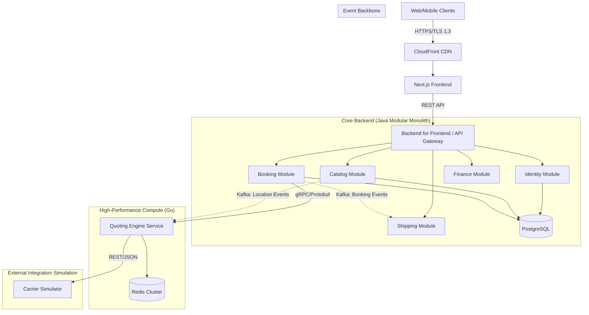

Here is the consolidated **System Architecture Definition** document for **VEYOR Marketplace 2.0**. This document integrates the Core Architecture, the High-Performance Quoting Engine, and the specific Non-Functional Requirements (NFRs) for the Carrier Simulator into a single source of truth.

---

# VEYOR Marketplace 2.0 - System Architecture Definition

## 1. Executive Summary

**Architecture Style:** Hybrid Modular Monolith with High-Performance Sidecars.
**Core Pattern:** Hexagonal / Layered Architecture.
**Frontend Pattern:** Single Page Application (SPA) with BFF.

The system is designed to balance development velocity with extreme computational performance. The core business domains (CRM, Finance, Booking Workflow) reside in a **Java Modular Monolith** to ensure strong consistency and domain cohesion. The Rate Calculation and Quoting domains are offloaded to a specialized **Go Microservice** to handle high concurrency, low latency, and complex mathematical aggregations.

---

## 2. System Context & Diagram

The system follows a strict flow where the Core Monolith acts as the orchestrator, delegating CPU-bound tasks to the Quoting Engine.

### 2.1 High-Level Architecture



---

## 3. Technology Stack

### 3.1 Frontend

* **Framework:** Next.js 14+ (React 18).
* **Language:** TypeScript 5.
* **State Management:** React Query (Server State) + Context API (UI State).
* **Styling:** TailwindCSS.

### 3.2 Core Backend (Monolith)

* **Runtime:** Java 21 (LTS).
* **Framework:** Spring Boot 3.2+.
* **Build Tool:** Gradle (Kotlin DSL).
* **ORM:** Hibernate 6 / Spring Data JPA.
* **Docs:** SpringDoc OpenAPI (Swagger).

### 3.3 Quoting Engine (Microservice)

* **Runtime:** Go (Golang) 1.22+.
* **RPC Framework:** gRPC (Google Protocol Buffers).
* **Data Structures:** RedisJSON, RediSearch.
* **Geospatial Lib:** Uber H3 (Hexagonal Hierarchical Spatial Index).

### 3.4 Data & Messaging

* **Primary Database:** PostgreSQL 16 (Schema-per-Module).
* **Cache/Hot Storage:** Redis 7 (ElastiCache).
* **Message Broker:** Apache Kafka.

---

## 4. Domain Module Specifications

The backend is strictly divided into logical boundaries. Dependencies between modules are forbidden unless mediated by defined contracts (API or Events).

### 4.1 Core Modules (Java)

| Module | Responsibility | Key Entities |
| --- | --- | --- |
| **Identity** | Authentication (OIDC), User Management, KYC, RBAC. | `User`, `Organization`, `Role` |
| **Catalog** | Master Data management (Ports, Commodities, HS Codes). Source of Truth for locations. | `Location`, `Commodity`, `Tariff` |
| **Booking** | Order placement workflow, State machine management, Orchestration of Quote Requests. | `Booking`, `QuoteRequest`, `Order` |
| **Shipping** | Physical execution, Tracking updates, Document handling (Bill of Lading). | `Shipment`, `Vessel`, `TrackingEvent` |
| **Finance** | Invoicing, Payment Gateway integration, Credit Limit checks. | `Invoice`, `Transaction`, `CreditProfile` |

### 4.2 High-Performance Modules (Go)

#### **Quoting Engine**

**Role:** Stateless calculation brain.
**Technology:** Go (Golang) with gRPC server.
**Architecture:** Clean architecture with `core` (business logic), `integration` (external clients), and `config` packages.

**Responsibilities:**

1. **gRPC Service:** Exposes `QuotingService.GetQuotes` on port 50051 using Protocol Buffers.
2. **Concurrent Orchestration:** Uses goroutines and `sync.WaitGroup` to fan out requests to multiple carriers in parallel.
3. **Dynamic Surcharge Aggregation:** Iterates through ALL surcharges returned by carriers (not just specific codes), summing amounts dynamically.
4. **Internal Business Rules:**
   - **OWS Logic:** Adds internal $150 OWS surcharge when weight > 21,500 kg AND carrier didn't include OWS
   - **Incoterm Tiering:** Adds $50 extra handling fee for EXW incoterms
5. **Profit Margin Application:**
   - Percentage markup: `SellPrice = TotalCost × (1 + MarginPercentage)`
   - Fixed fee: `SellPrice += FixedFeeUSD`
6. **Quote ID Generation:** Deterministic SHA-256 hash based on route, price, and timestamp.
7. **Error Resilience:** Logs carrier failures but continues processing other carriers (partial failure tolerance).
8. **Caching:** Redis integration planned (currently stubbed with TODO comments).

### 4.3 Simulation Modules (Node.js/Go)

#### **Carrier Simulator**

**Role:** Emulator for external logistics providers.
**Technology:** Go (Golang) with HTTP/REST API.
**Architecture:** Layered structure with `api`, `config`, `logic`, and `models` packages.

**Responsibilities:**

1. **Region-Based Dynamic Pricing:** Calculates base rates based on origin and destination regions (ASIA, EUROPE, AMERICAS, MIDDLE_EAST, SOUTH_ASIA, OTHER) with configurable multipliers for cross-regional routes.
2. **Equipment Sensitivity:** Applies multipliers based on container type:
   - 40FT/40HC: 1.8x base rate
   - 40RF (Reefer): 2.5x base rate
3. **Dynamic Surcharge Generation:** Returns variable surcharges including:
   - BAF (Bunker Adjustment Factor): $150
   - CAF (Currency Adjustment Factor): $50
   - OWS (Overweight Surcharge): $250 when weight > 22,000 kg
   - PSS (Peak Season Surcharge): $400 (randomly applied 30% of the time)
4. **Chaos Engineering:** Configurable failure injection:
   - Random latency (0-2000ms configurable)
   - Random HTTP 500 or 429 errors (5% default failure rate)
   - Debug headers for troubleshooting
5. **Location Code Normalization:** Handles both "CN-SHA" and "CNSHA" formats.

---

## 5. Functional Logic & Flow

### 5.1 The Quoting Workflow (End-to-End)

1. **Initiation:** Frontend sends `POST /api/quotes/search` with Origin, Destination, and Cargo Details.
2. **Orchestration (Java):** `Booking Module` receives the request. It validates the user and delegates the heavy lifting to the `Quoting Engine` via **gRPC**.
3. **Calculation (Go):**
* **Cache Check:** Generates a hash of the request parameters. Checks Redis for a valid cached result.
* **Fan-Out:** If cache miss, spawns concurrent **Goroutines** to call the `Carrier Simulator` (REST API).
* **Computation:**
* Converts Carrier Currency -> System Currency.
* Applies Volumetric Weight logic (Max(Actual, Volumetric)).
* Adds Profit Margins (Fixed + Percentage).


* **Aggregation:** Sorts results by Price and Transit Time. Returns `QuoteResponse` (Protobuf).


4. **Presentation (Java):** `Booking Module` maps the Protobuf response to a JSON DTO and returns it to the client.

### 5.2 Master Data Synchronization

The Go Service requires knowledge of Ports (UN/LOCODEs) to validate requests, but the `Catalog` module owns this data.

* **Pattern:** Event-Carried State Transfer.
* **Flow:**
1. Admin updates a Port in `Catalog` (Java).
2. `Catalog` publishes `LocationUpdatedEvent` to Kafka.
3. `Quoting Engine` (Go) consumes the event.
4. `Quoting Engine` updates its local Redis Set `REF_DATA:LOCATIONS`.


---

## 6. Integration Contracts

### 6.1 Internal High-Speed (Java <-> Go)

**Protocol:** gRPC / Protobuf v3.
**Port:** 50051
**Reasoning:** Type safety, binary compression (smaller payloads), and low latency for internal traffic.

**Actual Proto Definition:**

```protobuf
syntax = "proto3";

package quoting;

option go_package = "github.com/VEYOR/quoting-service/pkg/pb";
option java_package = "com.VEYOR.marketplace.modules.quoting.grpc";
option java_multiple_files = true;

service QuotingService {
  rpc GetQuotes (QuoteRequest) returns (QuoteResponse);
}

message QuoteRequest {
  string transaction_id = 1;
  string origin_locode = 2;
  string destination_locode = 3;
  string ready_date = 4;        // YYYY-MM-DD
  CargoDetails cargo = 5;
  string incoterm = 6;          // FOB, CIF, EXW
  string currency_requested = 7;// EUR, USD
}

message CargoDetails {
  string equipment_type = 1;    // 20FT, 40FT, 40HC, 40RF, LCL
  double total_weight_kg = 2;
  double total_volume_cbm = 3;
  string commodity_type = 4;    // GENERAL, HAZMAT, PERISHABLE
}

message QuoteResponse {
  repeated Quote quotes = 1;
}

message Quote {
  string quote_id = 1;
  string carrier_name = 2;
  double total_price = 3;
  string currency = 4;
  int32 transit_time_days = 5;
  string valid_until = 6;
  CostBreakdown breakdown = 7;
}

message CostBreakdown {
  double base_freight = 1;
  repeated Surcharge surcharges = 2;
  double fixed_fees = 3;
}

message Surcharge {
  string code = 1;
  double amount = 2;
}
```

### 6.2 External Simulation (Go <-> Carrier Mock)

**Protocol:** REST / JSON over HTTP/1.1.
**Endpoint:** `POST /api/search`
**Timeout:** 2000ms (configurable via `REQUEST_TIMEOUT_MS`)
**Reasoning:** To strictly mimic real-world integration standards with shipping lines (Maersk, MSC, etc.).

**Actual Request Payload:**

```json
{
  "origin": "CNSHA",
  "destination": "ESBCN",
  "departureDate": "2026-02-15",
  "equipment": "40RF",
  "weight": 21500.50,
  "commodity": "GENERAL"
}
```

**Actual Response Payload:**

```json
{
  "carrierId": "SIM-CARRIER-V1",
  "baseRate": 2700.00,
  "currency": "USD",
  "surcharges": [
    {"code": "BAF", "amount": 150.00},
    {"code": "CAF", "amount": 50.00},
    {"code": "PSS", "amount": 400.00},
    {"code": "OWS", "amount": 250.00}
  ],
  "validUntil": "2026-03-07"
}
```

**Error Responses:**
- HTTP 429: Too Many Requests (chaos mode)
- HTTP 500: Internal Server Error (chaos mode)
- HTTP 400: Invalid request (missing origin/destination)

---

## 7. Logic Specifications for Simulation

The **Carrier Simulator** implements the following business logic rules:

### 7.1 Region-Based Pricing Algorithm

**Base Price:** $1,500 (configurable baseline)

**Regional Multipliers:**
* Same Region: 0.6x (e.g., CNSHA -> CNSZX)
* Asia ↔ Europe: 1.8x
* Asia ↔ Americas: 2.2x
* Europe ↔ Americas: 1.5x
* Asia ↔ Middle East: 1.2x
* Asia ↔ South Asia: 0.8x
* Other combinations: 1.0x (default)

**Region Mapping:**
* ASIA: CN, JP, KR, SG, HK, TW
* EUROPE: DE, GB, FR, NL, ES, IT
* AMERICAS: US, CA, MX, BR
* MIDDLE_EAST: AE, SA, QA
* SOUTH_ASIA: IN, PK, BD

### 7.2 Equipment Sensitivity

* **20FT:** Base rate (no multiplier)
* **40FT/40HC:** 1.8x multiplier
* **40RF (Reefer):** 2.5x multiplier

### 7.3 Weight-Based Surcharges

* **OWS Threshold:** 22,000 kg
* **OWS Amount:** $250
* **Logic:** Carrier adds OWS surcharge when weight exceeds 22,000 kg (intentionally higher than Quoting Engine's internal threshold of 21,500 kg to test internal surcharge logic)

### 7.4 Dynamic Surcharges

**Always Applied:**
* BAF (Bunker Adjustment Factor): $150
* CAF (Currency Adjustment Factor): $50

**Conditionally Applied:**
* OWS (Overweight Surcharge): $250 when weight > 22,000 kg
* PSS (Peak Season Surcharge): $400 (30% probability)

### 7.5 Chaos Engineering Configuration

**Environment Variables:**
* `CHAOS_ENABLED`: true/false (default: true)
* `FAILURE_RATE`: 0.0-1.0 (default: 0.05 = 5%)
* `MAX_LATENCY_MS`: Maximum random latency in milliseconds (default: 2000)

**Failure Behavior:**
* 50% chance of HTTP 500 (Internal Server Error)
* 50% chance of HTTP 429 (Too Many Requests)

**Response Headers (for debugging):**
* `X-Simulated-Latency`: Actual latency injected
* `X-Simulated-Error`: Boolean indicating if error was injected


---

## 8. Non-Functional Requirements (NFRs)

The architecture MUST adhere to the following constraints to ensure quality of service across all modules.

### 8.1 Performance & Latency (Production)

* **Internal Processing:** The Quoting Engine (Go) must execute all internal math/logic in **< 10ms**.
* **End-to-End Budget:** Total Search API response time (P95) must be **< 1500ms** (assuming Carrier latency avg 1000ms).
* **Concurrency:** The Quoting Engine must support **1,000 concurrent calculation requests** per instance with predictable memory footprint.
* **Database:** Java Connection Pool (HikariCP) utilization must remain < 80% during peak load.

### 8.2 Reliability & Resilience

* **Timeouts:** All external calls from Go to Carrier must have a strict hard timeout (e.g., 2000ms).
* **Circuit Breakers:** Implemented on the Go client. If Carrier fails 5 sequential requests, open circuit for 30s to prevent cascading failures.
* **Statelessness:** All backend services must be stateless. Session data resides in Redis/JWT only.
* **Retry Policy:** Max 3 retries with exponential backoff for transient network errors (HTTP 502/503/504).

### 8.3 Security

* **Authentication:** Zero Trust. All internal gRPC calls must use mTLS or internal Token validation.
* **Authorization:** RBAC enforced at the Java BFF Controller level (`@PreAuthorize`).
* **Data Protection:**
* TLS 1.3 for all data in transit.
* AES-256 encryption for database at rest.


* **Secrets Management:** No hardcoded credentials. Use Vault or AWS Secrets Manager.

### 8.4 Observability

* **Distributed Tracing:** Implementation of **OpenTelemetry**.
* A single `TraceID` must persist from the Frontend -> Java BFF -> Go Engine -> Redis -> Carrier Mock.


* **Metrics:** Prometheus exposition for:
* `quote_requests_total`
* `calculation_latency_seconds`
* `carrier_api_errors_total`


* **Logging:** Structured JSON logging (Logback/Zap). PII must be redacted.

### 8.5 Carrier Simulator Specifics (Test Environment)

The Simulator module MUST meet these specific constraints to ensure it does not become a bottleneck during Load Testing of the Core system.

* **Throughput (Raw):** The simulator MUST handle **2,000 RPS** (Requests Per Second) when Chaos Mode is disabled.
* **Startup Time:** Container readiness must be **< 500ms** to allow rapid ephemeral environment spinning.
* **Debug Headers:** Responses MUST include `X-Simulated-Latency: {ms}` and `X-Simulated-Error: {bool}` to aid client-side debugging.
* **Chaos Logging:** MUST log the generated Random Seed or Chaos decision (e.g., `msg="Injecting 500 error"`) to allow debugging of failed test runs.

---

## 9. Infrastructure & Deployment

### 9.1 Container Strategy

The solution is deployed via Docker Containers orchestrated by Docker Compose (local dev) or Kubernetes (production).

**Core Services:**
* **Container 1 (Core):** `VEYOR-monolith` (Java/Spring Boot) - Port 8080
* **Container 2 (Compute):** `VEYOR_quoting_service` (Go/Alpine Linux) - Port 50051 (gRPC)
* **Container 3 (Mock):** `VEYOR_carrier_simulator` (Go) - Port 3000 (HTTP)

**Data Layer:**
* **Container 4 (Database):** `postgres:16` - Port 5432
* **Container 5 (Cache):** `redis:7` - Port 6379
* **Container 6 (Messaging):** `kafka` + `zookeeper` - Ports 9092, 2181

**Observability Stack:**
* **Container 7 (Metrics):** `prometheus` - Port 9090
* **Container 8 (Dashboards):** `grafana` - Port 3001
* **Container 9 (Tracing):** `jaeger` - Ports 16686 (UI), 4317 (OTLP gRPC), 4318 (OTLP HTTP)
* **Container 10 (Logs):** `loki` - Port 3100

**Supporting Services:**
* **Container 11 (Auth):** `keycloak` - Port 8081
* **Container 12 (Mail):** `mailhog` - Ports 1025 (SMTP), 8025 (UI)

**Environment Variables (Quoting Service):**
```yaml
GRPC_PORT: 50051
CARRIER_MOCK_URL: http://carrier-simulator:3000
REDIS_ADDR: redis:6379
MARGIN_PERCENTAGE: 0.15
FIXED_FEE_USD: 25.0
REQUEST_TIMEOUT_MS: 2000
```

**Environment Variables (Carrier Simulator):**
```yaml
PORT: 3000
CHAOS_ENABLED: true
FAILURE_RATE: 0.05
MAX_LATENCY_MS: 2000
```

### 9.2 CI/CD Pipeline

1. **Checkout & Lint:** Verify code quality (Checkstyle for Java, GolangCI-Lint for Go).
2. **Unit Test:** Run JUnit (Java) and `go test` (Go) in parallel.
3. **Build:** Create Docker images for Core and Quoting services.
4. **Integration Test:** Spin up ephemeral environment (Compose), run Blackbox tests asserting the Java->Go->Mock integration works.
5. **Publish:** Push to Container Registry (ECR/DockerHub).
6. **Deploy:** Rolling update to the target environment.