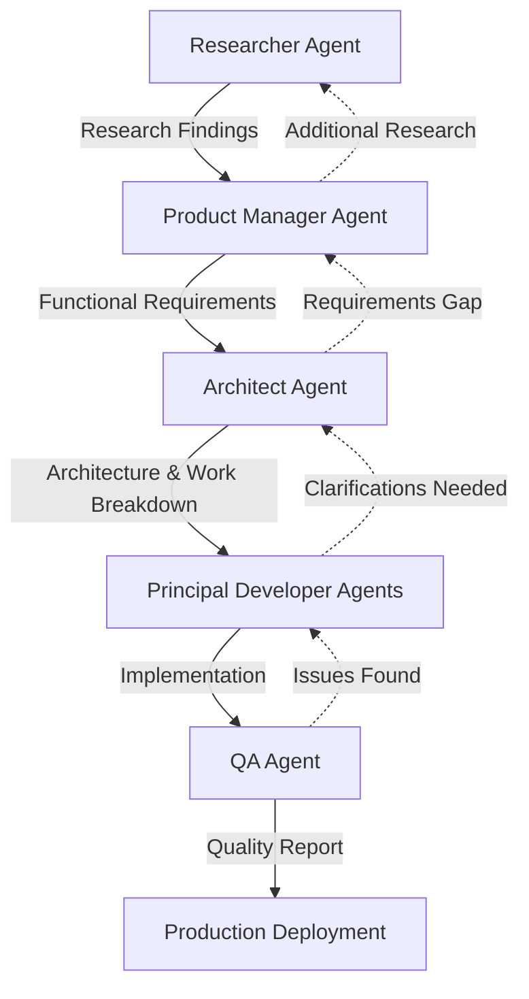

# Multi-Agent Coordination Framework

## Overview

This document defines how the five specialized agents coordinate to build a production-grade Flagsmith Kubernetes operator.

## Agent Workflow

## Phase Dependencies

### Phase 1: Research (Researcher Agent)
**Status**: 🔴 Ready to Start
- **Duration**: Estimated 2-3 days
- **Blockers**: None
- **Outputs**: Research documentation package
- **Next**: Product Manager Agent

### Phase 2: Requirements (Product Manager Agent)
**Status**: 🔴 Blocked - Waiting for Research
- **Duration**: Estimated 1-2 days
- **Blockers**: Researcher deliverables
- **Inputs**: Research findings
- **Outputs**: Functional requirements
- **Next**: Architect Agent

### Phase 3: Architecture (Architect Agent)
**Status**: 🔴 Blocked - Waiting for Requirements
- **Duration**: Estimated 2-3 days
- **Blockers**: Product Manager deliverables
- **Inputs**: Functional requirements, research findings
- **Outputs**: Architecture, NFRs, work breakdown
- **Next**: Developer Agents (parallel streams)

### Phase 4: Development (Principal Developer Agents)
**Status**: 🔴 Blocked - Waiting for Architecture
- **Duration**: Estimated 2-3 weeks (parallel)
- **Blockers**: Architect deliverables
- **Inputs**: Architecture, requirements, work assignments
- **Outputs**: Operator implementation with 80%+ test coverage
- **Next**: QA Agent

### Phase 5: Quality Assurance (QA Agent)
**Status**: 🔴 Blocked - Waiting for Development
- **Duration**: Estimated 1-2 weeks
- **Blockers**: Developer deliverables
- **Inputs**: Complete implementation
- **Outputs**: Quality reports, production readiness assessment
- **Next**: Production deployment

## Communication Protocols

### Agent Handoffs
1. **Completion Criteria**: Each agent must meet all deliverables before handoff
2. **Documentation**: All outputs must be documented in agent workspace
3. **Review**: Next agent reviews inputs before starting work
4. **Feedback Loop**: Agents can request clarifications from previous agents

### Status Updates
- Each agent maintains status in their CHARTER.md
- Status indicators:
  - 🔴 Not Started / Blocked
  - 🟡 In Progress
  - 🟢 Complete

### Issue Escalation
1. **Technical Blockers**: Escalate to Architect
2. **Requirements Gaps**: Escalate to Product Manager
3. **Research Needs**: Escalate to Researcher
4. **Quality Issues**: Escalate to QA

## Quality Gates

### Gate 1: Research Complete
- ✅ All documentation sources reviewed
- ✅ API documentation compiled
- ✅ Reference implementations analyzed
- ✅ Technology recommendations provided

### Gate 2: Requirements Complete
- ✅ Functional requirements documented
- ✅ All modules specified
- ✅ User stories defined
- ✅ Acceptance criteria established

### Gate 3: Architecture Complete
- ✅ Non-functional requirements defined
- ✅ System architecture designed
- ✅ Technology stack selected
- ✅ Work breakdown created
- ✅ Team structure defined

### Gate 4: Development Complete
- ✅ All components implemented
- ✅ 80%+ unit test coverage achieved
- ✅ Integration tests passing
- ✅ Code quality standards met
- ✅ Documentation complete

### Gate 5: QA Complete
- ✅ All functional tests passing
- ✅ Performance requirements met
- ✅ Load tests successful
- ✅ Chaos tests demonstrate resilience
- ✅ E2E tests passing
- ✅ Security audit clean
- ✅ Production readiness confirmed

## Parallel Work Opportunities

### During Research Phase
- Product Manager can prepare templates
- Architect can review operator patterns

### During Development Phase
- Multiple developer streams work in parallel
- QA prepares test environments and plans
- Documentation can be written concurrently

### During QA Phase
- Developers fix issues in parallel
- Documentation updates continue
- Deployment preparation begins

## Risk Management

### High-Risk Areas
1. **Flagsmith API Changes**: Monitor for API updates
2. **Kubernetes Version Compatibility**: Test across versions
3. **Performance at Scale**: Early load testing
4. **Security Vulnerabilities**: Continuous scanning

### Mitigation Strategies
- Regular sync meetings between agents
- Continuous integration and testing
- Early prototype validation
- Incremental delivery approach

## Success Metrics

### Project Success
- ✅ Production-grade operator delivered
- ✅ Zero critical failures in testing
- ✅ 80%+ test coverage maintained
- ✅ All quality gates passed
- ✅ Documentation complete

### Agent Success
- Each agent completes deliverables on time
- Minimal rework required
- Clear communication maintained
- Quality standards upheld

## Current Status

**Overall Project**: 🔴 Phase 1 - Research Initiation
**Next Milestone**: Research findings delivery
**Estimated Completion**: TBD based on research phase
